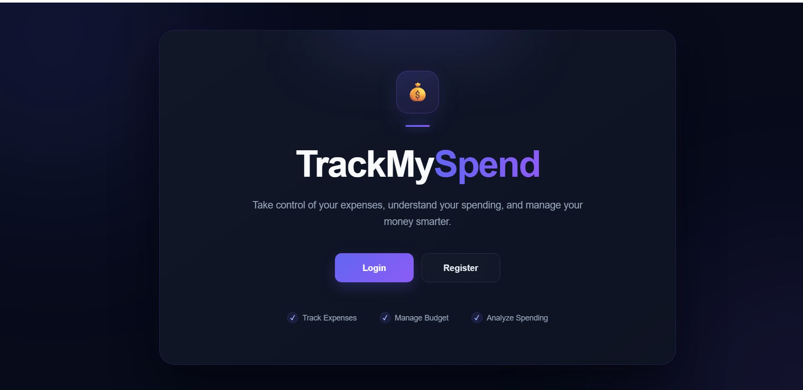
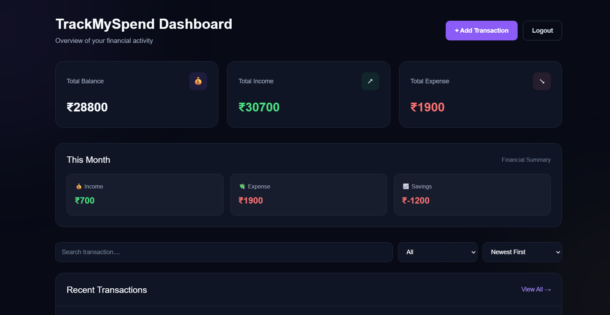
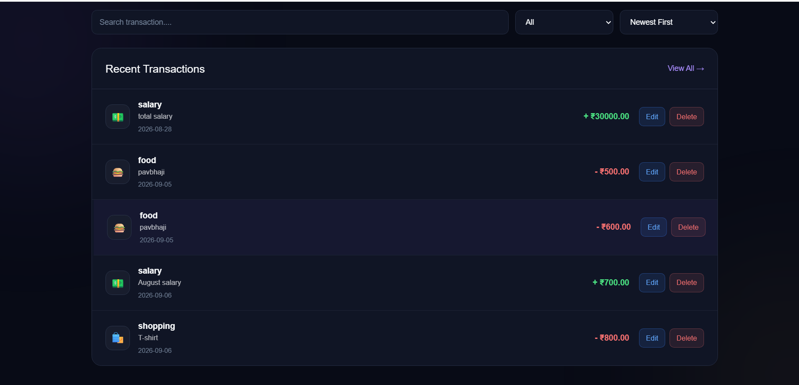

# TrackMySpend

TrackMySpend is a personal finance management web application that helps users track their income and expenses.

## Features

- User registration and login
- JWT authentication
- Add, edit and delete transactions
- Transaction history
- Search, filter and sort transactions
- Monthly financial summary
- Total income, expense and balance

## Technologies Used

- HTML
- CSS
- JavaScript
- Python
- Django
- Django REST Framework
- SQLite

## How to Run

```bash
python manage.py migrate
python manage.py runserver
```

Open `http://127.0.0.1:8000/` in your browser.

## Screenshots

### Landing Page


### Dashboard


### Transaction History
